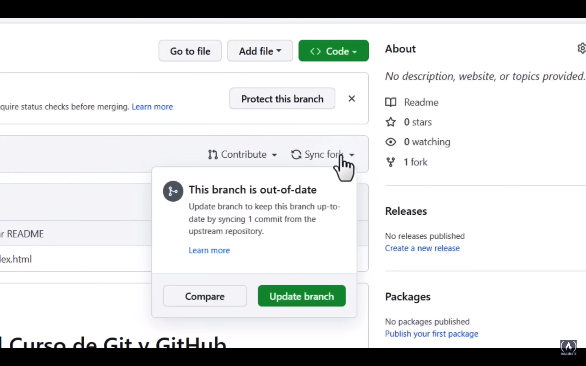
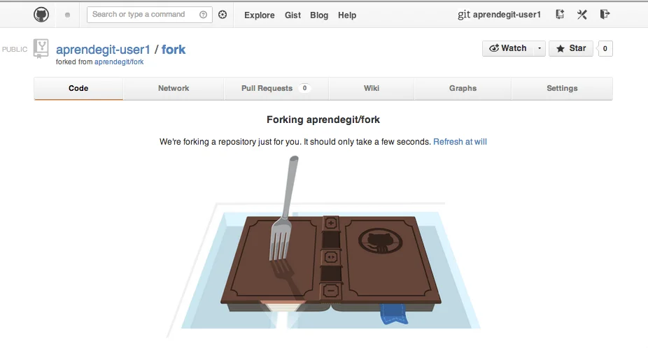
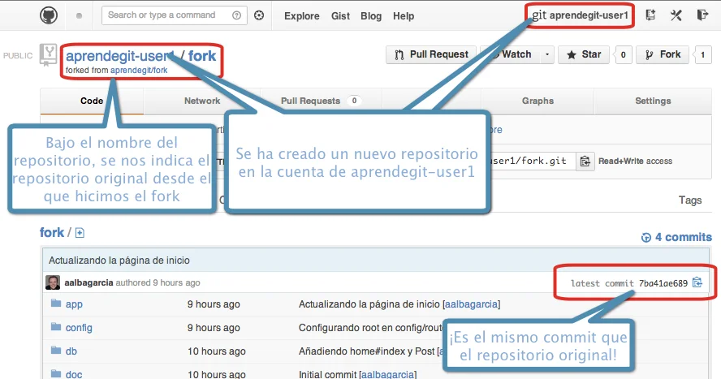
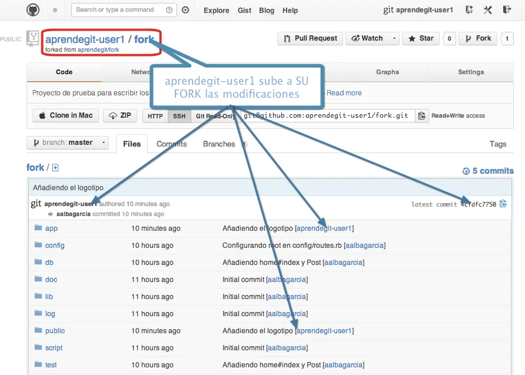
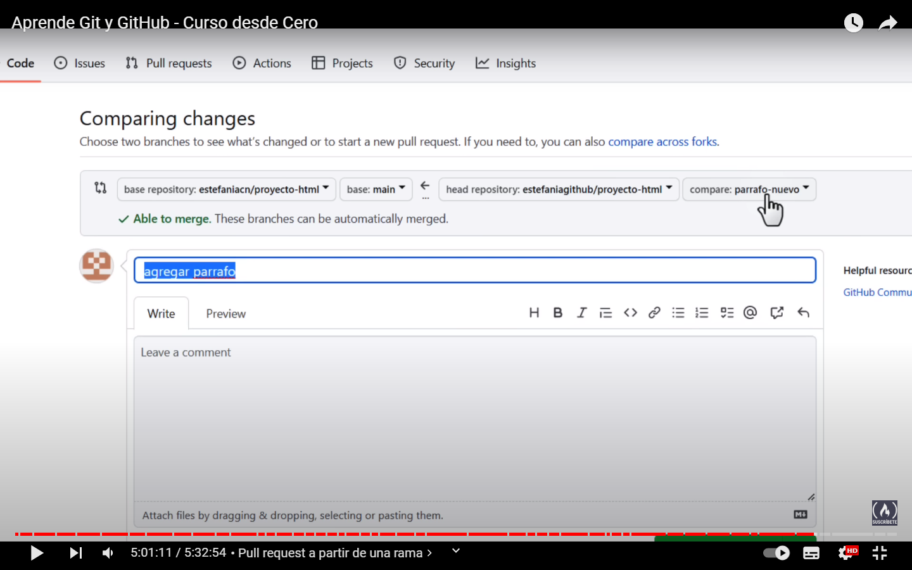

# The most used git commands.

The content of this git summary made by Julio Acosta was taken from the freeCodeCamp GitHub tutorial video in spanish. I was never able to fully understand git until I was able to watch this video.

Here it is: https://www.youtube.com/watch?v=mBYSUUnMt9M

Thank you so much to freeCodeCamp for your special efforts and sharing, and for all your contributions to us, the developers arround the world.

https://www.freecodecamp.org

## What is git ?

It is a version control system that allows us to track the changes we have made to a set of files.

A set of files is a group of folders and files. In this case it is folder that contains files that make up a software project.

## What is github ?
It is a hosting service that allows us to store software development and version control projects. 

## Creating and setting up your account.

Once you have downloaded the git application on your computer from https://git-scm.com/downloads, you can now start using the following commands.

You have to create an account at https://github.com/ and then use the following commands to allow your computer to 
communicate with github.com through the username of your email account. This will allow you to send (push) and receive (pull) files from your local repository (a git project folder) on your local computer to your remote repository on the github repository server.

### Setting up the config.

Lets set the config attributes for all local respositories that will be created in your local computer.

```
git config --global user.name "your-username"
git config --global user.email "your-email"
```
For your own security, you can also use here an email provided by github.com instead of using your own email. Since all the information pushed toward your github account will be marked with this email address and you may not want other git users to see it.

### Getting the current config.

```
$ git config user.name
$ git config user email 
```

### Linking git with Visual Studio Code.

Git allows you to define the editor to use with it. The word "--wait" in the following command means that your OS should wait for the configuration to be saved before continuing with other processes.

For Visual Studio Code editor.
```
$ git config --global core.editor "code --wait"
```

For the Atom editor.
```
$ git config --global core.editor "atom --wait"
```

### Initializing the current directory.

In order for you to make a proyect-folder in your computer to become a local git repository, you must apply the following command, this will create a hidden directory called .git into it, which will contained all the versions of your code. And then your proyect-folder will be considered as a local repository. So you must never enter into the .git folder or change or delete it. You must always work in your proyect-folder not into your .git folder which is into it.

```
$ make proyect-folder
$ git init
Output: Initialized empty Git repository in C:/xampp/htdocs/proyect-folder/.git/
```

You must always work here:
```
C:/xampp/htdocs/proyect-folder/
```
Of course, the path here is just an example of any possible path to your computer using your operating system's command-line interface or git's command-line bash interface.

### Set your Master branch as Main.

In previous versions of git, the master branch was called "master" and the rest of the branches were "slave" branches that you could name whatever you wanted. But for ethical and racism-free reasons, git no longer uses those terms. Instead, the master branch should be renamed to main.

```
$ git branch -M main // Set the name of the master branch as main. The -M is a parameter to change the name.
```

## Available Areas: Modification, Staging and Respository.

There are three different stages of a file when working with git:

* 1.- Modification.
* 2.- Staging (Preparation).
* 3.- Respository (it's your .git hidden folder).

### Modification Area (or Working Area).

When a file has been created or modified with Visual Studio Code or any other editor and it is into your proyect folder but you have not yet applied the following command to pass it to the staging area.

To pass your file or files to the staging area.
```
$ git add filename // Send a file to the staging area.
$ git add . // Send all files to the staging area.
```

### Staging Area (Preparation)

In this area you will find all the files that are currently being tacked by git, but have not yet been passed to the repository area.

Sending your files from the staging area to the repository area.
```
$ commit -m 'write a comment" // Will send all the tracked files to the local repository.
```

### Repository Area (Confirmed Area)

Technically speaking, the repository area is a folder called .git which has been created into your proyect folder when you applied the "git init" command to it. This .git folder is hidden and contains all the versions, branches and commits of your proyect.

### Basic commands

It allows you to see the status of the files in your local repository and some usefull info about the status of the commits in your remote repository.

```
git status // Will show the status of the files. 
```

Add a file to the staging (preparation) area.
```
$ git add filename // Add a file
$ git add . // Add all files.
```

Saca del area de preparacion a un archivo.
```
$ git rm --cache filename 
```

## Commit (Commitment)

The commit command send a file from the staging area to the repository area or .git folder.

Commit is a basic component of a git project timeline. It is basically a record or photo of the project at a specific time. Possibly they are logs that are created when executing this command and these logs could be stored in log files in the .git folder of the project.

A commit occurs when you have implemented some new functionality or some important change. And it is very important to make a good comment about what you did.

Commits have unique identifiers. This identifier is a SHA or (Secury Has algorithm)

The SHA identifies three things:

1.- The changes made.
2.- When and where the changes were made.
3.- Who made the changes.

Date, Time, User, Email,
Author: Day Month Hour Year and
Comment, there are some attributes that are associated with the identifier.

```
$ git commit -m "Comentario o mensaje"
```
You can also open Visual Code to write the commit comment. Simply type git comment and press the <Enter> key from the git bash terminal.

```
git commit <Enter>
```
When a commit is executed, the terminal output returns an identifier.

You can see the logs of the commints using the log command. 
```
git log // You will see the logs of the commits.
```

### Changing the comment of an alredy done commit. 

The following command is only recommended to be done in the local repository. Remember, the local repository is the one on your computer. In the remote repository, -in github-, this command is not done when you execute this command. And because other developers may have already cloned this repository and such change in the comment will not be made in those cloned repositories.

In short words, those developers will not know about a change that you did in a comment of an already done commit.

```
$ git commit --amend "Re-writing a comment."
```

## Going back in the timeline.

if you notice that you did not do something in the change that you wanted to do and you feel that need to go a step back in your timeline of changes (commits), you can execute the following command:

```
$ git reset --soft HEAD~1 
$ git log // You won't see the last done commit.
```
--soft . It means that only the commit record will be deleted, but the changes or modifications you made to the files in that last commit will preserve the changes you made.

Now all those files are no longer in the Stage Area, but in the Modify Area. Hence
Now you can modify everything you need and add all the files to the staging area, and then commit again.

```
git add . 
git commit -m "Add comment"
```

--hard . This will destroy all the changes you made in your last commit.

HEAD~1 - It means you want to go back one step in the commit history timeline.


## Meaning of letters in files in Visual Studio Code.

Letters in files:

U = File that is not being tracked. That is, it is in the working directory that is being modified but not in the staging area.

A = The file is now in the staging area. A "git add" was applied.

M = The file has been modified. And you have to move it to the preparation area.

Note: It can be said that once you have committed a file or your entire project and make any changes to a file, that file will now go to the modification area again. And you wiil now have to do againg the following commands:

```
git add filename 
git commit -m 'A comment'
```

## Branches (Ramas)

A branch is an independent line of development. A branch is an exact copy of everything
the project, yes, of all the existing files in the main branch until the moment of
create the branch.

Once we have a copy of the repository, we can create a standalone copy that develops independently of other branches.

```
$ git branch version-javascript // Created a branch called version-javascript

```

```
$ git branch // List all the branches in the local repository.
$ git branch -a // List all the branches in the remote repository.
```

```
$ git checkout version-javascript // Permite cambiar a la rama version-javascript.
```

The following command does both steps. Just remember that when running this command. As well as the other two above, a branch or copy of your project will be created from the branch in which it is currently located. That is, if it is in main, then a copy will be created with all the contents of the main branch. But if you are in a sub branch, then from that
branch the copy will be made.

```
$ git checkout -b version-python // Created the version-python branch it change to it.
```

Para volver a la rama main
```
$ git checkout main
```

## Changing the name of a branch.

By changing your location to tha branch.

```
$ git branch // List all branches.
$ git checkout version-javascript // Changing to it.
$ git branch -m version-js // Changing the name.
```

## Changing the name of a branch fro the main branch.
```
$ git checkout main // Going to the main branch.
$ git branch // List all branches.
$ git branch -m version-python version-py // Providing a current name and a new name.
```
The previous command to change the name using the param -m, receives two parameters or
arguments. The first one is the current name of the branch that you intend to rename and the second one is the new name.

## Deleting a branch.

Applies to local branches and not to github branches. And you should not be inside the branch you want to delete. Preferably use the main branch to delete from there.

```
$ git branch -d version-jv // delete the branch version-jv
Output: Deleted branch version-jv (was b699681).
```

You can also delete a branch located in the remote repository (origin) from the command line.
```
$ git push origin -d your-branch-name // This will delete the branch in the remote repository.
```

## Git log for branches.

```
$ git checkout version-jv
$ git log // List the done commits.
$ git log -p // To see the commit history doing pauses. You can exit from the git log -p mode using the Q letter.
```

Commits are inherited to new branches created. But new branches can create their own commits and these will not be part of the commits of the main branch.

## Git log in just one line.

```
$ git log --oneline // Will show a list of commits with thier information in one line.

Output: 
6617de2 (HEAD -> version-js) I did this change.
b699681 (main) I have added a second file.
012fc84 I have modified the index.html file.
```

## Merge Branches (Combine Branches)

Merge Branches is a process that allows several independent lines of development to be combined into a single branch.

Branches are actually temporary, their function is to add new functionality or fix a problem. Actually once you finish, you should merge the branches and delete them.

Important: To do a merge you must be in the branch that will receive the merge.

Option 1.- Doing a merge towards the main branch. You must go to the main branch.

```
$ git branch
$ git checkout main
$ git merge texto-expandido // Merge the texto-expandido branch into main branch.
```

Option 2.- Making a merge using two arguments. The branch that will receive the modifications and the branch that contains the modifications.
```
$ git branch // List the branches
$ git checkout main // Change to the main branch.

$ git merge main expanded-text // The main bracnh will recieve and the expanded-text has the new content.

$ git log // List all commits.
$ git log --oneline // List commits in one line.
```
The above command worked in git version 2.39.2.windows.1. But may not work in other versions.

## Conflicts on Merging Branches.

Conflicts arise when the same line of a file, the same element or text is modified. What git considers as incompatible.

```
$ git checkout main // Go first to the main branch.
$ git merge version-js // Merge the changes done in local version-js branch with the local main branch.
```

## Cloning a repository

Clone a repository means creating a local copy of a remote repository on your computer. Including their versions and commit history.

important: When we clone a repository, we don't need to initialize the folder with git init.
We do not also need to assign the url to the origin using the git remote add origin remote-url command, this is done automatically when using the git clone command.

```
$ git clone https://github.com/Julioxfiles/php-replace.git
```

If you alredy have add a remote value to your origin placeholder like this:
```
$ git remote add origin https://github.com/Julioxfiles/php-replace.git 
```

then you can do:
```
$ git clone origin // This will clone the remote repository.
```

origin - is a variable or placeholder in our local repository that recieves the value of the remote path repository. So the next time we have to use that path we just neet to use origin in its place.

This will show the path of the remote repository if we have done the git remote add origin command.
```
$ git remote
$ git remote -v // Will show the paths for push and fetch remote repositories. The origin value.
```

### push
Push or move changes from our local repository to our remote repository on github.com

```
$ git push origin main // Send the local main repository to our remote repository (origin).
```

### pull

Used to download the content of a remote repository and immediately update a local repository so that both have the same information.This command merges the changes. That is, it automatically does a git merge.

```
$ git pull origin main // It brings us the origin remote repository and its main branch. The update to the local repository is immediate.
```

### fetch (or Search)

It is used to verify changes made on the remote repository without merging those changes to the local repository yet. This command does not update data automatically when performing a git merge from the remote repository to the local one.

This command checks if there is a new branch in the remote repository that is not in the local repository and then fetches it from the remote repository by creating a copy in the local repository.
```
$ git fetch origin // This checks if a new branch exists in the remote repository and creates that branch in the local repository.
```

You can also create a new branch in the local repository and then pull the remote branch into that new local branch.
```
$ git checkout -b new-branch-name
$ git pull origin new-branch-name // Get the remote branch data from github.
```

Git feth lets you know if changes have been made to the remote repository since you last updated your local repository with git pull.

## Viewing changes in the remote branch from the git command line.

```
$ git checkout origin/main
// You will see the remote main branch in your local computer.
```

To go back to the main local branch use:
```
$ git checkout main 
```

## Linking a repository to your local git repository on your PC.

This command will set the url path of your remote repository in github with your local repository.

```
$ git remote add origin https://github.com/Julioxfiles/php-replace.git
```

The local branch main is pushed to the remote origin repository.
```
$ git push -u origin main // Upload or push the main branch to the remote origin repository (origin). 
```

## Fork (Bifurcar un repositorio)

Ahead several definitions of what a fork is in github.

Making a fork is the action of creating a copy of another user's repository in your own github user account.

A fork is an exact copy, made in your github account, of a github repository that is usually not yours. That is, in github you can go to a repository and click on the Fork button of repository of another user and when you click on it, github will ask you for your own github credentials to be able to make a copy of such a repository in your own account.

Forking is copying an existing repository owned by another github user into your github account. Which means creating a new url for that repository but in your account. This makes a complete copy of the entire repository in your account.

A fork is done by going to a user's account and clicking on the "fork" button of the repository that you want to fork toward your user account.

### Steps to make a fork and clone it.

1.- Go to the repository of the git account where you want to contribute. If it is a public repository, you just have to go there and click on it and log in with your account and user and a copy (fork) will be created in your user account.

On the other hand, if the repository of the account to which you want to contribute is private, then the owner of that repository must add you as a contributing user or colaborator. And then you can have access to such repository and do the fork.




Wait a few seconds. You may be redirect to your own github repository.




Some info to keep in mind.







2.- Clone the repository from your github account, remember that you are going to clone the fork that is in your account and not the one from the original repository. Because, you can only push a repository that resides in your account and not in someone else's account.

### Doing a clone step by step.
  
1.- Create a directory on your computer
```
$ mkdir project-name
```

2.- Clone the fork that you did and that it is in your own git account.
```
$ git clone https://github.com/julioxfiles/project-name.git 
```

3.- Install the project dependencies on your computer.
    
#### If the project is a Javascript proyect or if you are working with laravel/mix then do:

```
$ npm i
$ npm audit fix
$ npm audit fix -force
$ npm run bundle
$ npm run build //
$ npm run live-server // runs the development server.
```
Note: Do npm run build-demo if it exists and enter the demo directory.

#### If the project is in PHP or Laravel.

3.1 - Install all the dependencies.
```
$ composer install
```

3.2 - Make a copy of the env_example file and rename 
it as .env. Change the values of the DB_DATABASE, DB_USERNAME, DB_PASSWORD of the .env file to the local xampp enviroment. Or if a development server is used, ask for this information.

3.3 - Create the database in phpMyAdmin.
    
3.4 - Generate key for the APP_KEY attribute in the .env file

```
$ php artisan key:generate // Generate the key 
to use in APP_KEY attribute of the .env file
```

3.5 - Migrate
```
$ php artisan migrate // To perform the migrations.
```

Note: If in your project you use social networks to log in then you have to copy the credentials or tokens of those social networks also here at the end of the .env file

### Pull Requests (Solicitudes de combinacion).

A pull request is a request to merge your changes made in your repository that you forked and then cloned and to which you added changes and then uploaded them to your forked repository in your github account with the original repository from which you forked.

It is a request that you make through github by clicking on a Pull Requests button of the forked project that you have modified. This request is made by github to the owner of the original project so that they can analyze the changes you made and then incorporate your changes into their project.

## Common way of working with other developers in github.

Normally when working with a group of developers what is done is the following:

1.- A fork of the project in which you will make some contribution is made. This is done from the github page. Once the fork of such a project (repository) is made, a copy of that project will be hosted in your github user account.

2.- A folder is created on your computer. It is not necessary to initialize the folder. Nor add the origin.
```
$ mkdir project-name // This make a directory called project-name.
```

3.- A clone of the fork that you made has to be done. The fork that was left in your github user account.
```
$git clone https://github.com/julioxfiles/fork-project-name.git 
```

4.- Once the cloning is done in the previous step, a new branch is created with a descriptive name of what you are going to do.
```
$ git ckeckout -b 'new-feature' // This will create a new branch called 'new-feature' and will change to it.
```

5.- The pertinent changes are made to the files with Visual Studio Code and saved.

6.- The following commands are executed:
```
$ git status
$ git add.
$ git commit -m "I have added a new feature"
$ git push origin new-feature // The new-feature branch is uploaded. This will create for you a new branch with that new-feature name on github.
```

7.- The request or pull request is made to the owner of the original repository from github.
You must keep in mind that the pull request must be made from the new-feature branch of your account to the main branch of the original project account.

Note: The creation of the branch in point number 4, is very necessary because if any problem occurs you will only need to delete the branch and the project that you have in your github account will remain unchanged. Otherwise, if you didn't create the branch, then you would have to create a new fork of the entire project again.



## How to update your forked copy when changes (new commits) have already been made to the original project.

Once you have forked a repository. In your github account you will be informed if new changes or updates have been made to the original project. If this happens you must click to Synchronize the original project with your forked copy. That is, so that the new changes made in the original project are passed to your forked copy.


Una vez que hayas actualizado tu bifurcacion utilizando este boton deberas tambien actualizar tu repositorio local.
Recuerda que para actualizar tu repositorio local necesitas realizar el siguiente comando:

```
$ git checkout main
$ git status // Para ver si no tienes ningun commit que hacer. De hecho aqui se espera que no tengas commits que hacer. Porque se supone que siempre debes trabajar en una rama.
$ git pull origin main // Estro jalara los datos de la rama main de tu respositorio remoto.
```

## Summary

When contributing to a project you should always make a fork of the original project in which you are going to contribute in your github account.

If you already did the previous step of forking some time before. Then you must start by synchronizing the main branch of your fork with the new changes that the original project has. This is achieved by clicking the "sync changes" button from your fork in your github account.

If it is the first time that you are going to work on a fork, then you make a clone of your fork to your machine. And you must create a branch to add the new functionality with which you are going to contribute.

```
$ git clone https://github.com/my-user/my-fork.git
$ git checkout -b my-new-feature // You start working and then finish.
$ git status
$ git add .
$ git push origin my-new-feature
```

If this is not the first time you are going to work with your fork, then you do not need to clone the fork again in your local repository. Only pull changes from the "main branch" that you already synchronized in github with your local main branch.

```
$ git pull origin main // Here the main branch of the remote repository is always pulled and never a branch of the remote repository.
```

Now that the branch where you are going to make the contribution is created. You can also delete other existing branches that you no longer need and that have already been approved by the owner of the original repository when using your pull requests.
```
$ git branch -d branch // This will delete the branch that is no longer needed because the owner of the original proyect did approve and merge to its own original main branch.
```

## Issues

Issues are errors in a program or document within the project or repository. They serve to inform the project owner of your intention to collaborate in repairing the errors you detected. So instead of forking, cloning,  branching, updating and making a pull request. You may first want to inform the user who owns the project about the situation.

Issues can be opened, edited, deleted, closed as completed, or closed as unsolved.

Name and color labels can also be added to the numbers to classify the type of topic they cover.

Done by: Julio Acosta.